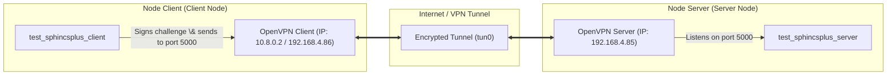

# SPHINCS+ (Research Fork)

This repository is a fork of the upstream SPHINCS+ implementation ([sphincs/sphincsplus](https://github.com/sphincs/sphincsplus)), customized for post-quantum cryptography (PQC) research and benchmarking. SPHINCS+ is standardized as [FIPS 205](https://csrc.nist.gov/pubs/fips/205/final).

It contains:
- `ref/`: portable reference C implementation
- `haraka-aesni/`: x86_64 implementation using Haraka with AES-NI
- `sha2-avx2/`: x86_64 implementation using SHA2 + AVX2 (x8)
- `shake-avx2/`: x86_64 implementation using SHAKE + AVX2 (x4)
- `shake-a64/`: AArch64 implementation using SHAKE (x2)
- `ref/test/`: TCP client/server demo + stress tool (POSIX/WSL)

For a list of changes in this fork, see [CHANGELOG.md](CHANGELOG.md).

---

## Table of Contents

- [Reproducibility Quick Start](#reproducibility-quick-start)
- [Build](#build)
- [Executable Files \& Their Functions](#executable-files--their-functions)
- [Correctness Tests](#correctness-tests)
- [Benchmarking (Cycle Counts)](#benchmarking-cycle-counts)
- [Deterministic Test Vectors](#deterministic-test-vectors)
- [NIST KAT Generator (Optional)](#nist-kat-generator-optional)
- [TCP Client/Server Demo \& OpenVPN Network Setup](#tcp-clientserver-demo--openvpn-network-setup)
- [Coverage (Optional)](#coverage-optional)
- [License](#license)

---

## Reproducibility Quick Start

### Platform Notes

- **Linux is recommended** for reproducible benchmarking.
- **macOS** builds the `ref/` implementation fine in most setups; `shake-a64/` is intended for AArch64.
- **Windows**: Use **WSL2** for the simplest build/run workflow (some benchmarks/tools use POSIX APIs).

### Dependencies

Ubuntu/Debian:

```sh
sudo apt-get update
sudo apt-get install -y build-essential make pkg-config libssl-dev python3
```

Optional tools:

```sh
sudo apt-get install -y valgrind lcov
```

macOS (OpenSSL headers/libs may require flags):

```sh
brew install openssl
export CFLAGS="-I$(brew --prefix openssl)/include"
export NISTFLAGS="-I$(brew --prefix openssl)/include"
export LDFLAGS="-L$(brew --prefix openssl)/lib"
```

---

## Build

All commands below assume you are at the repository root.

### Instance Selection

You can select a SPHINCS+ instance and tweakable-hash variant via Makefile variables:
- `PARAMS`: `sphincs-<hash>-<sec><opt>` where:
  - `<hash>` is `sha2`, `shake`, or `haraka`
  - `<sec>` is `128`, `192`, or `256` (targets NIST security categories 1, 3, 5)
  - `<opt>` is `s` (smaller signatures) or `f` (faster signing)
- `THASH`: `simple` or `robust`

Examples:

```sh
make -C ref clean PARAMS=sphincs-sha2-128f THASH=simple
make -C ref tests PARAMS=sphincs-shake-256s THASH=robust
```

### Reference Implementation (`ref/`)

Build everything (KAT generator + tests + benchmark binary):

```sh
make -C ref clean
make -C ref all
```

This produces:
- `ref/PQCgenKAT_sign`
- `ref/test/spx`
- `ref/test/fors`
- `ref/test/benchmark`
- `ref/test/test_sphincsplus`

### Haraka AES-NI Implementation (`haraka-aesni/`)

Requires an x86_64 CPU with AES-NI.

```sh
make -C haraka-aesni clean
make -C haraka-aesni all
```

### SHA2 AVX2 Implementation (`sha2-avx2/`)

Requires an x86_64 CPU with AVX2.

```sh
make -C sha2-avx2 clean
make -C sha2-avx2 all
```

### SHAKE AVX2 Implementation (`shake-avx2/`)

Requires an x86_64 CPU with AVX2.

```sh
make -C shake-avx2 clean
make -C shake-avx2 all
```

### SHAKE AArch64 Implementation (`shake-a64/`)

Intended for AArch64.

```sh
make -C shake-a64 clean
make -C shake-a64 all
```

### TCP Client/Server \& Keygen (Under `ref/test/`)

To compile the TCP challenge-response network binaries, local benchmarks, and stress testing tools:

```sh
make -C ref/test clean
make -C ref/test all
```

This compiles all files (by default using `PARAMS=sphincs-sha2-128f THASH=simple`):
- Key generation: `test_sphincsplus_keygen`
- TCP Server: `test_sphincsplus_server`
- TCP Client: `test_sphincsplus_client`
- Stress testing: `test_sphincsplus_stress`
- Local correctness: `test_sphincsplus`
- Speed benchmarking: `test_speed`
- Local vector generation: `test_vectors`

---

## Executable Files \& Their Functions

This section guides you through the roles and functionalities of all compiled executable binaries in the project:

### 1. TCP challenge-response Network Binaries (`ref/test/`)

| Executable | Purpose \& Detailed Behavior |
| :--- | :--- |
| `test_sphincsplus_keygen` | **Keypair Generator**: Generates SPHINCS+ public and private key pairs. Saves them to three binary files in the working directory:<br>- `client_sk.bin` (Client's secret key, used for signing).<br>- `client_pk.bin` (Client's public key).<br>- `server_pk.bin` (Server's public key copy, used to verify the client's signature). |
| `test_sphincsplus_server` | **TCP Verification Server**: Listens on TCP port `5000` (by default) for connections.<br>- On startup, it loads the public key from `server_pk.bin`.<br>- When a client connects, it transmits a challenge payload to the client.<br>- It waits for the client to return a signature, then verifies the signature using the loaded public key.<br>- Verification results, CPU timing, and RSS memory usage are logged to `server.log`. |
| `test_sphincsplus_client` | **TCP Signing Client**: Connects to the server's IP address on port `5000` (default target IP is `192.168.4.85`).<br>- On startup, it loads the private key from `client_sk.bin`.<br>- Receives the challenge payload from the server.<br>- Signs the challenge payload using SPHINCS+ signature APIs (`crypto_sign`).<br>- Transmits the signature back to the server and logs network details to `client.log`. |
| `test_sphincsplus_stress` | **Load \& Stress Testing Tool**: Spawns multiple concurrent client sessions using POSIX `fork()` to query the server simultaneously. By default, it connects to `192.168.4.85` with 10 concurrent sessions.<br>- Tests server concurrency, stability under load, and monitors memory/CPU overhead.<br>- Configurable via environment variables: `TARGET_IP`, `CONCURRENT_SESSIONS` (number of processes), `BATCHES` (number of runs), and `BATCH_DELAY_SEC` (delay between batches). |

### 2. Local Algorithm Testing Binaries

| Executable | Location | Description |
| :--- | :--- | :--- |
| `test_sphincsplus` | `ref/test/` | **Correctness Test**: Verifies the basic logic of the SPHINCS+ signature algorithm locally (Keygen -> Sign -> Open/Verify) in memory. It serves as a sanity check to verify compilation without requiring a network. |
| `test_speed` | `ref/test/` | **Speed Benchmarking**: Executes key operations (Keygen, Sign, Verify) in a loop and prints average CPU time and median CPU cycle counts utilizing `RDTSC`. |
| `test_vectors` | `ref/test/` | **Deterministic Vector Generator**: Produces deterministic test vectors to verify compliance with specification standards. |

---

## Correctness Tests

Verify implementation correctness locally:

```sh
make -C ref test
```

Optimized implementations:

```sh
make -C haraka-aesni test
make -C sha2-avx2 test
make -C shake-avx2 test
make -C shake-a64 test
```

This fork also includes an additional harness under `ref/test/test_sphincsplus.c`:

```sh
make -C ref test_sphincsplus
cd ref
./test/test_sphincsplus
```

---

## Benchmarking (Cycle Counts)

Single instance (reference):

```sh
make -C ref benchmark
```

Sweep all instances across multiple implementations (prints results as it goes):

```sh
python3 benchmark.py
```

---

## Deterministic Test Vectors

Generate SHA256 sums for all instances (reference implementation):

```sh
python3 vectors.py
```

Check one instance against `SHA256SUMS` using a specific implementation directory:

```sh
python3 vectors.py sphincs-shake-128s-simple shake-avx2
```

---

## NIST KAT Generator (Optional)

Build and run the NIST KAT generator (`PQCgenKAT_sign`) for a selected instance:

```sh
make -C ref clean PARAMS=sphincs-sha2-128f THASH=simple
make -C ref PQCgenKAT_sign PARAMS=sphincs-sha2-128f THASH=simple
cd ref
./PQCgenKAT_sign
```

This writes `PQCsignKAT_*.req` / `PQCsignKAT_*.rsp` in the current directory.

---

## TCP Client/Server Demo \& OpenVPN Network Setup

This guide walks you through setting up, connecting, and running a remote challenge-response session between a **Node Server** and a **Node Client** on different networks using **OpenVPN** to bridge the connection securely.

### Network Topology



### Step 1: Set Up OpenVPN Between the Nodes

If the nodes reside on different networks or behind strict NAT firewalls, use OpenVPN to map them into a shared Virtual Private Network (VPN). To use the default server IP of the codebase:

1. **On the Server Node (hosting the Server App)**:
   - Install and configure an OpenVPN server.
   - Configure OpenVPN to use IP routing (**TUN** mode).
   - Configure your OpenVPN server or local routing so the Server Node's virtual VPN interface gets assigned the IP **`192.168.4.85`** (the codebase's default target IP).
   - Ensure the server firewall allows incoming connections on port `5000` (for the TCP demo) and port `1194` (for OpenVPN).
   - Export a client configuration profile (e.g., `client1.ovpn`).

2. **On the Client Node (hosting the Client App)**:
   - Install the OpenVPN client package (`openvpn` or OpenVPN Connect).
   - Copy the `client1.ovpn` file from the Server Node onto the Client Node.
   - Establish the VPN tunnel:
     ```sh
     sudo openvpn --config client1.ovpn
     ```

3. **Verify Connectivity**:
   - Check that you can ping the Server Node from the Client Node: `ping 192.168.4.85`.

---

### Step 2: Build Network Binaries on Both Nodes

On both the Server and Client nodes, compile the network binaries under the test directory:

```sh
# Clean and compile client, server, stress, and keygen binaries
make -C ref/test clean
make -C ref/test all
```

---

### Step 3: Run Keypair Generator and Copy Public Key

To establish trust between the client and server, a keypair must be generated first.

On the **Client Node**, run the keygen binary:
```sh
cd ref/test
./test_sphincsplus_keygen
```
*Note: No parameters are required.* This generates:
- `client_sk.bin` (Client Secret Key - remains on Client Node)
- `client_pk.bin` (Client Public Key - remains on Client Node)
- `server_pk.bin` (Server Verification Public Key - **must be copied to Server Node**)

Copy `server_pk.bin` from the Client Node to the `ref/test/` directory on the **Server Node** (e.g., via `scp` over the VPN link):
```sh
scp server_pk.bin user@192.168.4.85:/path/to/sphincsplus-dev/ref/test/
```

---

### Step 4: Run Server, Client, and Stress Test (No Parameters Needed)

Once the keys are in place and the Server Node is accessible at `192.168.4.85`, you can run the server, client, and stress test directly without specifying any IP parameters since `192.168.4.85` is the built-in default destination.

1. **On the Server Node**:
   ```sh
   cd ref/test
   ./test_sphincsplus_server
   ```
   *Note: No parameters are required.* The server will automatically load `server_pk.bin` and listen on port `5000`.

2. **On the Client Node (Single Request)**:
   ```sh
   cd ref/test
   ./test_sphincsplus_client
   ```
   *Note: No parameters are required.* The client automatically connects to the server at `192.168.4.85:5000`, receives the challenge, signs it, sends the signature back, and exits.

3. **On the Client Node (Concurrent Stress Test)**:
   ```sh
   cd ref/test
   ./test_sphincsplus_stress
   ```
   *Note: No parameters are required.* By default, it spawns 10 concurrent processes targeting `192.168.4.85` and cycles indefinitely.

---

### Step 5: Customizing Client and Stress Test (Optional Parameters)

If you wish to override the default settings (e.g. running on a different server IP, changing the number of concurrent sessions, or setting a run limit), pass them as command arguments or environment variables:

- **Client with Custom Server IP**:
  ```sh
  cd ref/test
  ./test_sphincsplus_client <CUSTOM_SERVER_IP>
  ```
- **Stress Tool with Custom Variables**:
  ```sh
  cd ref/test
  TARGET_IP=192.168.4.85 CONCURRENT_SESSIONS=50 BATCHES=5 BATCH_DELAY_SEC=1 ./test_sphincsplus_stress
  ```

---

## Network Protocol Details

The protocol is framed as follows:
1. **Server → Client**: `uint32_be length` followed by the raw challenge bytes.
2. **Client → Server**: `uint32_be length` followed by the raw signature bytes.

All logs and generated `.bin` keys are saved under `ref/test/`. You can override the client log destination using the `CLIENT_LOG_PATH` environment variable.

---

## Coverage (Optional)

There is no dedicated coverage script in this fork. If you want coverage, build with coverage flags using `EXTRA_CFLAGS` (supported by the Makefiles), run tests/benchmarks, then use your preferred tooling (e.g., `gcov`/`lcov`).

---

## License

See [LICENSE](LICENSE) and the licenses under [LICENSES/](LICENSES).
